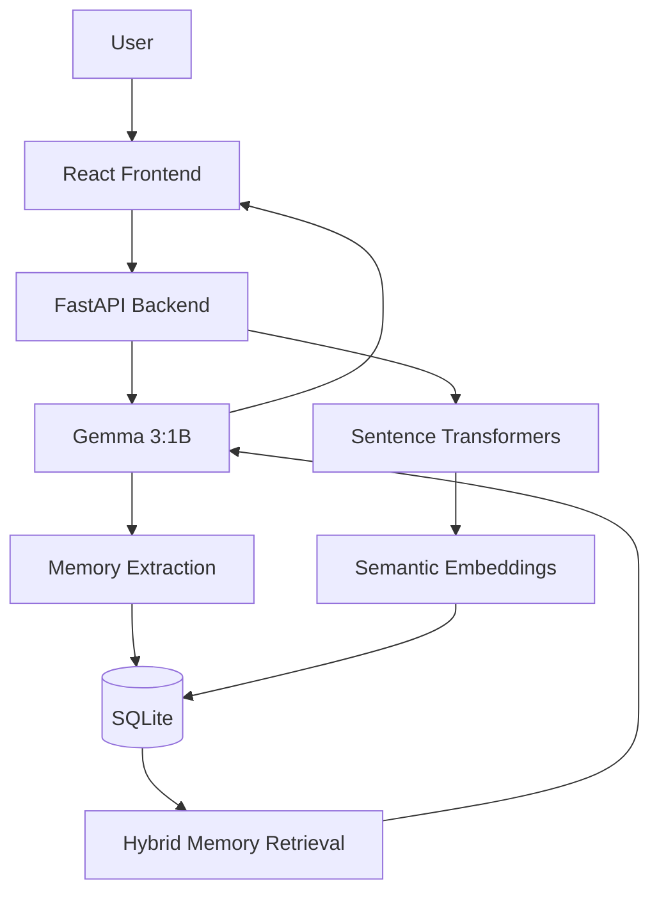

# 🧠 MemoMate

> **My friend talks. MemoMate remembers.**

MemoMate is a **local AI-powered personal memory assistant** built for a real friend who wanted a simple way to keep track of things they say, think about, and need to remember.

Instead of manually organizing everything into separate notes, to-do lists, and contacts, MemoMate lets the user **talk naturally**. It extracts useful information, stores it as structured memories, and lets the user ask questions about those memories later.

<p align="center">

**📝 Tasks &nbsp; • &nbsp; 💡 Ideas &nbsp; • &nbsp; 👥 People &nbsp; • &nbsp; 🧠 Personal Context**

</p>

---

## ✨ Features

- 📝 **Task Memory** — remembers things you need to do
- 💡 **Idea Memory** — captures project ideas and thoughts
- 👥 **People Memory** — remembers people mentioned in conversations
- 📌 **Notes** — stores useful personal context
- 🔎 **Semantic Retrieval** — finds relevant memories using embeddings
- 💬 **Natural Language Questions** — ask questions about your memories
- 🤖 **Local AI** — uses an open-weight model through Ollama
- 🔒 **Local-First** — core AI processing runs on the user's machine
- ⚡ **Lightweight** — designed to run on a regular laptop without a dedicated GPU

---

## 🎯 The Problem

People often remember that they **said or thought about something**, but not exactly where they wrote it down.

This project started from a simple problem faced by a real friend:

> *"I want something that remembers the things I tell it without making me organize everything manually."*

Instead of building another conventional notes or to-do application, MemoMate was designed around **natural conversation**.

The goal is simple:

> **Tell MemoMate something once. Find it later without having to remember where you put it.**

---

## 🧠 How MemoMate Works

MemoMate combines a local language model, embeddings, retrieval, and a web interface.

### Memory Creation

```text
User message
     │
     ▼
React Frontend
     │
     ▼
FastAPI Backend
     │
     ▼
Gemma 3:1B
     │
     ▼
Memory Extraction
     │
     ├── Tasks
     ├── Ideas
     ├── People
     └── Notes
     │
     ▼
SQLite + Embeddings
```

### Asking a Question

```text
User question
     │
     ▼
FastAPI Backend
     │
     ├──────────────► Semantic Embedding
     │
     ▼
Memory Retrieval
     │
     ▼
Relevant Stored Memories
     │
     ▼
Gemma 3:1B
     │
     ▼
Natural Language Answer
```

The retrieval system combines **semantic similarity and keyword matching** to find relevant memories before passing them to the local language model.

---

## 🏗️ Architecture



### Main Components

| Component | Technology | Purpose |
|---|---|---|
| Frontend | React + Vite | User interface |
| Backend | FastAPI | API and application logic |
| Database | SQLite | Stores memories |
| LLM | Gemma 3:1B | Memory extraction and answers |
| Embeddings | all-MiniLM-L6-v2 | Semantic memory retrieval |
| Local AI Runtime | Ollama | Runs the local language model |
| Version Control | Git + GitHub | Source code and collaboration |

---

## 🤖 AI Architecture

MemoMate uses two different AI components for different jobs.

### 1. Gemma 3:1B

Gemma 3:1B is used for:

- extracting information from natural language
- identifying tasks, ideas, people, and notes
- generating answers from retrieved memories

The model runs locally through **Ollama**.

### 2. all-MiniLM-L6-v2

The Sentence Transformer model converts memories and questions into numerical embeddings.

This allows MemoMate to find memories that are **semantically related**, even when the exact words are different.

For example:

```text
Stored memory:
"I need to complete my DBMS assignment tonight."

Question:
"What do I have to finish today?"
```

The wording is different, but semantic similarity can still connect the question with the stored memory.

---

## 🔒 Why Local Open-Source AI?

MemoMate deals with personal information.

Memories can contain:

- personal plans
- relationships
- project information
- tasks
- private conversations
- ideas

For this type of application, sending every memory to a remote AI service is not always desirable.

MemoMate therefore uses an **open-weight model running locally** through Ollama.

The core workflow can run as:

```text
Your Laptop
│
├── React
├── FastAPI
├── Gemma 3:1B
├── Sentence Transformers
└── SQLite
```

This demonstrates how open AI models can be combined with conventional software engineering components to build a useful personal application without requiring a hosted AI API for the core workflow.

> **Note:** Local execution does not automatically guarantee complete privacy or security. MemoMate is currently a prototype and has not undergone a formal security audit.

---

## 💬 Example

Suppose the user tells MemoMate:

```text
I have to finish my DBMS assignment tonight.
I'm thinking about using a recommendation system
for our college project.
Priya is working with me on the project.
Tomorrow I need to send Rahul the project files.
```

MemoMate can extract:

### 📝 Tasks

```text
Finish DBMS assignment tonight
Send Rahul the project files tomorrow
```

### 💡 Idea

```text
Use a recommendation system for the college project
```

### 👥 People

```text
Priya
Rahul
```

The user can then ask:

```text
What do I need to do tomorrow?
```

MemoMate can answer:

> **Send Rahul the project files tomorrow.**

Or:

```text
What idea did I have for the college project?
```

MemoMate can answer:

> **You were thinking about using a recommendation system for your college project.**

Or:

```text
Who is working with me on the project?
```

MemoMate can answer:

> **Priya is working with you on the project.**

---

## 🛡️ Reliability

Small local language models can sometimes generate information that was not actually provided by the user.

MemoMate therefore does not rely entirely on the model for every decision.

The application includes **application-level safeguards** for important memory queries and uses retrieved memories as the source of context for generated answers.

The goal is to make the system more reliable while keeping the AI lightweight enough to run locally.

---

## 🚀 Getting Started

### Prerequisites

Make sure you have:

- [Python](https://www.python.org/) 3.12+
- [Node.js](https://nodejs.org/)
- [Git](https://git-scm.com/)
- [Ollama](https://ollama.com/)

A dedicated GPU is **not required** for the current lightweight model setup.

---

### 1. Clone the repository

```bash
git clone https://github.com/whoaditi/memomate.git
cd memomate
```

---

### 2. Create a Python virtual environment

On Windows:

```bash
py -m venv .venv
```

Activate it:

```bash
.venv\Scripts\activate
```

---

### 3. Install Python dependencies

```bash
py -m pip install fastapi uvicorn ollama sentence-transformers numpy
```

---

### 4. Download the local AI model

Make sure Ollama is running, then:

```bash
ollama pull gemma3:1b
```

You can verify the model:

```bash
ollama list
```

You should see:

```text
gemma3:1b
```

---

### 5. Start the backend

From the project root:

```bash
py -m uvicorn api:app --reload
```

The backend will run at:

```text
http://127.0.0.1:8000
```

---

### 6. Start the frontend

Open another terminal:

```bash
cd frontend
npm install
npm run dev
```

Vite will provide a local URL, usually:

```text
http://localhost:5173
```

Open that URL in your browser.

---

## 📁 Project Structure

```text
MemoMate/
│
├── api.py
├── database.py
├── memomate.py
├── semantic_search.py
├── ask_memory.py
├── add_embedding.py
├── backfill_embeddings.py
├── clear_db.py
├── embed_test.py
├── test_ai.py
├── view_memories.py
│
├── frontend/
│   ├── src/
│   │   ├── App.jsx
│   │   ├── App.css
│   │   ├── index.css
│   │   └── main.jsx
│   │
│   ├── package.json
│   └── vite.config.js
│
├── .gitignore
└── README.md
```

---

## 📸 Screenshots

> Screenshots will be added here.

### MemoMate Dashboard

<!-- Add screenshot here -->

### Memory Extraction

<!-- Add screenshot here -->

### Asking MemoMate

<!-- Add screenshot here -->

---

## 🎥 Demo

**Demo video:** Coming soon

The demonstration shows:

1. Entering a natural-language memory
2. MemoMate extracting structured information
3. Viewing saved tasks, ideas, people, and notes
4. Asking questions about previous memories
5. Receiving answers based on stored information

---

## ⚠️ Current Limitations

MemoMate is currently a prototype, so there are several limitations:

- The current AI model is intentionally lightweight.
- Memory extraction can still make mistakes.
- The current core workflow focuses on text input.
- Voice input is planned but is not part of the current core implementation.
- There is currently no multi-user authentication system.
- The project has not undergone a formal security audit.
- The lightweight model may produce less sophisticated responses than larger models.

These limitations are part of the trade-off for keeping the system **local and laptop-friendly**.

---

## 🔮 Future Improvements

Planned improvements include:

- 🎙️ Voice input
- 🔐 User authentication
- 👤 Multiple personalized memory profiles
- 🗂️ Better memory organization
- 🧠 Improved long-term memory management
- 🔎 More advanced retrieval
- 🕒 Time-aware memories and reminders
- 📱 Improved mobile experience
- 🧪 Automated evaluation of memory extraction accuracy
- 🤖 Experimentation with larger local models when hardware permits

---

## 🙌 Built for a Friend

MemoMate was built for the **Hacktoberfest 2026 "Build for a Friend"** challenge.

The project started with a person's real problem rather than starting with a technology and looking for a use case afterward.

The idea was simple:

> **Build something useful for someone you actually know.**

MemoMate explores how open AI models can make personal software more useful while keeping the core AI workflow local.

---

## 📚 What I Learned

Building MemoMate involved working with:

- FastAPI APIs
- React frontend development
- SQLite databases
- Local LLM inference
- Ollama
- Sentence Transformers
- Semantic search
- Retrieval-augmented generation concepts
- Prompt design
- AI reliability safeguards
- Git and GitHub

One of the biggest lessons was that building an AI application is not only about choosing a model.

A useful AI application also needs:

**good data → retrieval → application logic → reliability safeguards → user experience**

---

## 📄 License

This project is open source.

Add your preferred license before the final release.

---

<p align="center">

**Built with ❤️, React, FastAPI, SQLite and local open-source AI.**

</p>